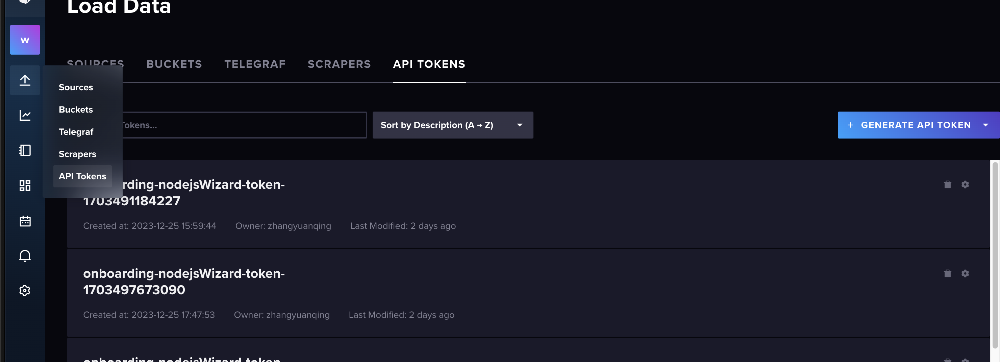
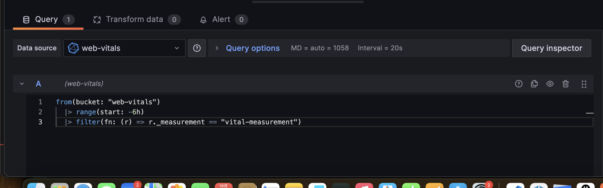
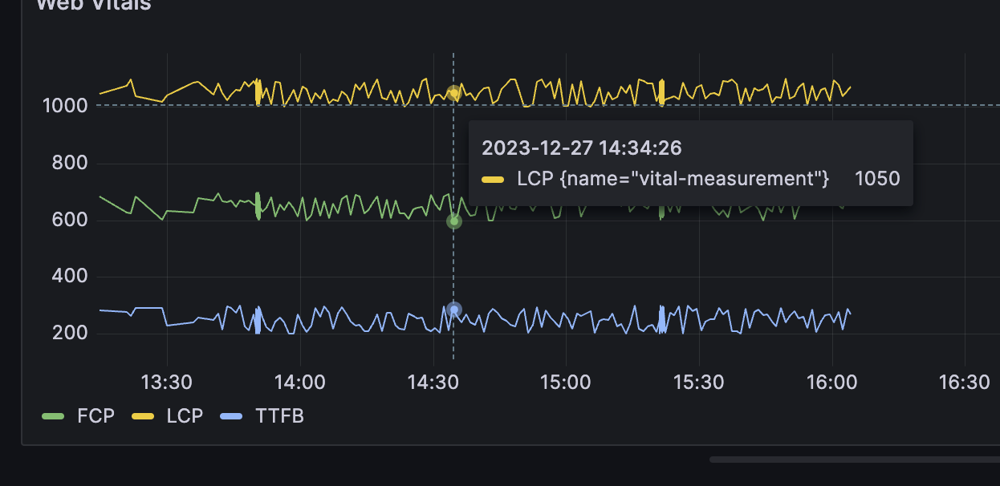

# WEB-VITALS-REPOTER

此项目旨在搭建一个简单的前端性能监控 demo。项目中包含前端项目和后端项目。其中前端项目在 `packages/frontend` 文件夹下，用来模拟用户进入页面时候的数据上报行为。后端项目在 `packages/backend` 文件夹下，用来提供一个 `writeVitals` API来将上报的数据写入 `influxdb` 数据库中。

此外，你还需要使用 `grafana` 来导入 `influxdb` 数据源，并且使用简单的数据查询语法来绘图。

## 环境要求

环境要求只包含了apple m1以上芯片的软件安装。 

### 前端项目

#### nodejs

```shell
brew install node
```

### 后端项目 

### influxdb

```sh
brew install influxdb
brew services start influxdb
brew services stop influxdb
```

influxdb默认运行在 `localhost:8086` ，访问UI界面之后，在 `influxdb` 中建立一个 `web-vitals-org` 的org，建立一个 `web-vitals` 的bucket，
保存influxdb 为你生成的 `token` 字符串，用这个 `token` 字符串去替换项目中 `packages/backend/.env` 文件中的 `INFLUXDB_TOKEN` 的值。

你可以在下面这个页面生成 `token`，它是你访问 `influxdb` 数据库的凭证。



### Grafana

```sh
brew install grafana
brew services start grafana
brew services stop grafana
```

Grafana默认运行在 `localhost:3000`

修改 `/opt/homebrew/etc/grafana/grafana.ini` 来更改 Grafana运行的端口

Grafana的默认账号密码为 admin admin

## 项目运行

1. 在项目的根目录下，开启corepack,得到 pnpm 工具

```shell
corepack enable
pnpm i
```

2. 运行后端项目

```shell
cd packages/backend
pnpm dev
```

3. 运行前端项目

```shell
cd packages/frontend
pnpm dev
```

4. 此时我们就会收集数据到 `influxdb` 数据库了

我们浏览器访问Grafana所在的端口，在Grafana中导入 `influxdb` 数据源，并且添加一个 `Dashboard`,点击 `Add Visualization`，
在下方的query中输入下面的 `flux` 语句，点击右上角的apply按钮

```flux
from(bucket: "web-vitals")
  |> range(start: -6h)
  |> filter(fn: (r) => r._measurement == "vital-measurement")
```



5. 结果
 